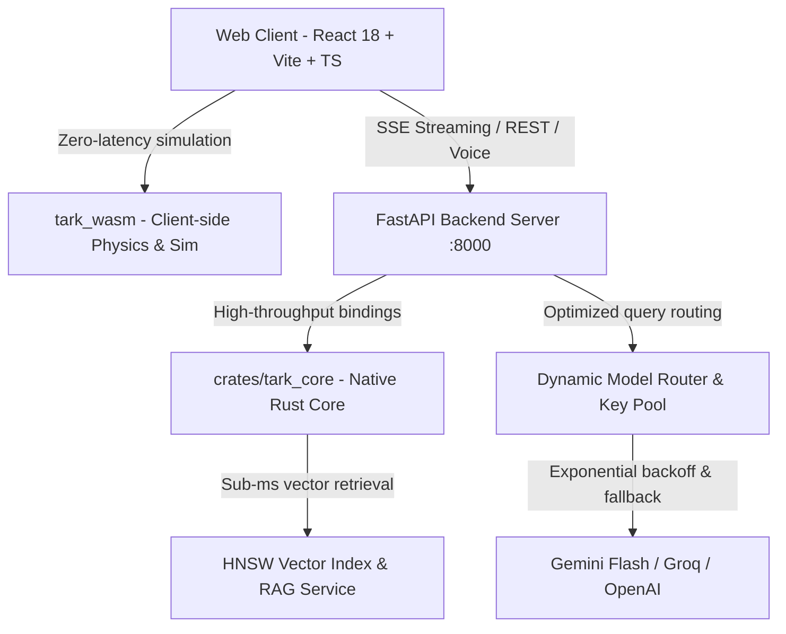

<div align="center">

# 🧠 TARK (तर्क)
### Next-Generation AI Tutor & Interactive STEM Learning Platform

[](https://www.rust-lang.org/)
[](https://webassembly.org/)
[](https://fastapi.tiangolo.com/)
[](https://react.dev/)
[](https://www.typescriptlang.org/)
[](https://tailwindcss.com/)
[](https://opensource.org/licenses/MIT)

**Tark** (*from Sanskrit तर्क: reasoning, rigorous logical dialectic*) is an AI-powered personal tutor built for deep STEM comprehension. By combining high-performance **Rust computational engines**, zero-latency in-browser **WebAssembly (WASM) simulations**, curriculum-grounded **Dual-Pane Textbooks**, and **Socratic pedagogy**, Tark transforms rote memorization into intuitive mastery.

[Key Features](#-key-features) • [Architecture](#-architecture) • [Getting Started](#-getting-started) • [Core Subsystems](#-core-subsystems) • [License](#-license)

</div>

---

## ✨ Key Features

### 🎓 1. Adaptive Pedagogy & Teaching Modes
- **Teacher Mode**: Structured concept breakdowns with step-by-step conceptual scaffolding, rigorous mathematical notation (KaTeX), and real-world analogies.
- **Socratic Mode**: Active discovery tutor that asks targeted diagnostic questions to guide students toward answers without ever spoiling solutions.
- **Oral Evaluation Engine**: Voice-driven oral examination that assesses conceptual depth, probes edge cases, and provides instant holistic rubrics.

### ⚡ 2. High-Performance Rust & WebAssembly Engine (`crates/`)
- **Rust CAS (Computer Algebra System)**: Fast symbolic differentiation, expression tree parsing, AST canonicalization, and zero-error mathematical equivalence testing.
- **WASM Virtual Lab**: 120 FPS physics and calculus simulations running client-side with zero network latency:
  - *Chaotic Double Pendulum* (Runge-Kutta 4 integration)
  - *N-Body Gravitational Orbital Dynamics* (Symplectic Euler)
  - *2D Heat Diffusion Equation* (Finite difference method)
  - *Lorenz Strange Attractor & Wave Mechanics*
- **HNSW Vector Search (`tark_core::rag`)**: Native Hierarchical Navigable Small World graph for sub-millisecond similarity queries over curriculum embeddings.
- **Audio VAD (`tark_core::audio`)**: Real-time Voice Activity Detection and energy analysis for responsive live voice conversations.

### 📚 3. Dual-Pane Curriculum Textbook & RAG
- **Curriculum-Grounded**: Deep indexing of standard curricula across **CBSE, ICSE, Maharashtra State Board (Balbharati), and IGCSE**.
- **Interactive Textbook Viewer**: Read textbooks on the left, highlight complex paragraphs or diagrams, and resolve doubts instantly in the interactive AI pane.
- **Diagram Lightbox**: High-resolution STEM diagrams with interactive zoom and AI visual explanations.

### 🎙️ 4. Live Voice & Audio Tutor
- Full-duplex conversational voice tutoring with ultra-low latency response times.
- Natural speech synthesis and responsive barge-in voice interruption detection.

### 📊 5. Mathematical Grader & Correctness Seam
- Automatic verification of algebraic and calculus solutions.
- Flags mathematical hallucination instantly by offloading symbolic math to SymPy and the Rust CAS engine rather than relying on pure LLM generation.

---

## 🏛️ Architecture



---

## 📁 Repository Structure

```
tark/
├── crates/
│   ├── tark_core/           # Native Rust engine: CAS, HNSW RAG, Audio VAD, Calculus
│   │   ├── src/advanced_math/ # FFT, Lorenz attractor, Quadrature, Roots
│   │   ├── src/cas/           # Computer Algebra System (AST, differentiation, solver)
│   │   ├── src/physics/       # Double pendulum, Heat equation, N-Body mechanics
│   │   ├── src/rag/           # High-performance HNSW vector search
│   │   └── src/audio/         # Voice Activity Detection (VAD)
│   └── tark_wasm/           # WebAssembly bindings for 120 FPS browser simulations
├── backend/                 # Python 3.12+ FastAPI Microservice
│   ├── app/
│   │   ├── main.py          # FastAPI application & lifecycle
│   │   ├── router/          # Dynamic model routing with multi-key pooling
│   │   ├── modes/           # Socratic, Teacher, and Oral Exam prompt orchestrators
│   │   ├── cas/             # Rust CAS & SymPy correctness verification endpoints
│   │   ├── rag/             # Textbook retrieval & embedding pipelines
│   │   ├── simulations/     # Simulation catalog, parameters, and grounded guidance
│   │   ├── social/          # Peer rooms, study groups, and collaboration
│   │   ├── tasks/           # Study scheduling and progress tracking
│   │   └── auth/            # Secure session & user management
│   └── scripts/             # Data fetchers and curriculum ingestion pipelines
├── frontend/                # Modern React 18 + TypeScript + Vite Web Application
│   ├── src/
│   │   ├── components/      # VirtualLabModal, DualPaneTextbookView, LiveVoiceModal
│   │   ├── wasm/            # Compiled WebAssembly simulation runtime
│   │   ├── simulations/     # Interactive simulation templates and renderers
│   │   ├── api.ts           # SSE chat stream client and error handlers
│   │   └── styles.css       # Custom design system with glassmorphism
└── docs/                    # Technical architecture, benchmarks, and API guides
```

---

## 🚀 Getting Started

### Prerequisites
- **Node.js**: v18.0.0 or higher
- **Python**: v3.11 or v3.12
- **Rust**: 1.80+ (optional for building Rust crates from source)
- **Git**

---

### 1. Clone the Repository
```bash
git clone https://github.com/svdgamerz/tark.git
cd tark
```

---

### 2. Backend Setup

1. Create and activate a Python virtual environment:
   ```bash
   cd backend
   python -m venv .venv
   ```

   *Windows (PowerShell):*
   ```powershell
   .venv\Scripts\python.exe -m pip install -r requirements.txt
   ```

   *macOS/Linux:*
   ```bash
   source .venv/bin/activate
   pip install -r requirements.txt
   ```

2. Configure environment variables:
   Create a `.env` file in the `backend/` directory:
   ```env
   # LLM Providers (at least one key required)
   GEMINI_API_KEY=your_gemini_api_key_here
   GROQ_API_KEY=your_groq_api_key_here

   # Database (Optional - defaults to local SQLite store)
   SUPABASE_URL=
   SUPABASE_SERVICE_KEY=

   # Search & Tool Augmentation (Optional)
   TAVILY_API_KEY=
   ```

3. Launch the Backend Server:
   ```powershell
   .venv\Scripts\python.exe -m uvicorn app.main:app --reload --port 8000
   ```
   *The FastAPI server will be live at `http://127.0.0.1:8000` (Swagger docs at `/docs`).*

---

### 3. Frontend Setup

1. Open a new terminal and navigate to the frontend directory:
   ```bash
   cd frontend
   npm install
   ```

2. Run the Vite development server:
   ```bash
   npm run dev
   ```
   *Open your browser and navigate to **`http://localhost:5173`**.*

---

## 🔬 Core Subsystems

### WebAssembly Virtual Lab
Tark compiles high-fidelity physics models into WebAssembly (`frontend/src/wasm/`), allowing students to interact with real-time numerical simulations at display refresh rates (60–120 FPS) without server lag.
- Double pendulum dynamics using 4th-order Runge-Kutta numerical integration.
- N-body gravitational systems demonstrating orbital resonance and chaotic perturbation.
- 2D heat diffusion using finite difference schemes.

### Dynamic Model Router
Located in `backend/app/router/`, the model router prevents rate-limiting issues by:
- Managing a pool of API keys across providers (Gemini, Groq, OpenRouter).
- Routing tasks based on latency and token demands (e.g., streaming chats use Gemini 1.5 Flash or Groq LLaMA 3.3 70B).
- Automatic retry with exponential backoff on `429 Too Many Requests`.

### Mathematical Correctness Seam
LLMs frequently hallucinate mathematical derivations. Tark verifies symbolic calculations by parsing formulas into mathematical ASTs via the Rust CAS engine (`crates/tark_core/src/cas/`) and checking symbolic identity before confirming steps to the user.

---

## 🧪 Testing & Verification

- **Frontend Type Check**:
  ```bash
  cd frontend
  npx tsc --noEmit
  ```
- **Backend AST Syntax & Verification**:
  ```bash
  cd backend
  python test_checker_unit.py
  python test_rust_features.py
  ```
- **Rust Crate Verification**:
  ```bash
  cd crates/tark_core
  cargo check
  ```

---

## 📄 License
This project is open-source under the [MIT License](LICENSE).
