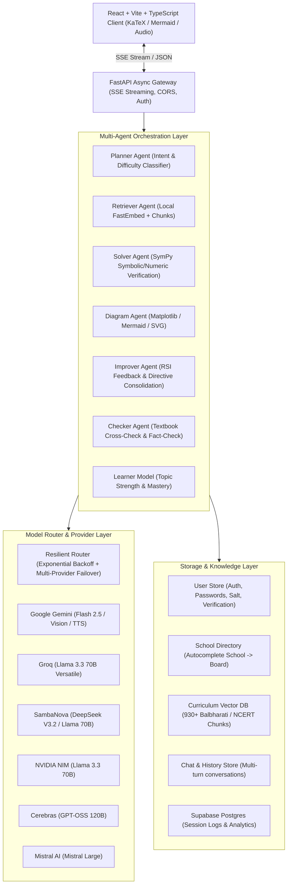

# TARK (तर्क) — Comprehensive System & Feature Documentation
**Adaptive, Curriculum-Grounded AI Teaching Engine**

---

## 1. Executive Summary & Vision

**Tark** (derived from the Sanskrit *tarka*, meaning *reasoning* and *logic*) is an advanced adaptive AI tutor engineered for school and university education.

### Core Philosophy:
> *"The language model is the engine; the pedagogy and correctness are the product."*

Unlike generic chat wrappers, Tark is a multi-agent teaching platform designed to instruct with genuine pedagogical rigor, strict mathematical correctness, board-specific curriculum grounding (RAG), dynamic code-rendered visual diagrams, adaptive student learner models, and recursive self-improvement loops.

---

## 2. System Architecture & Tech Stack

### Technology Stack Summary:
- **Frontend**: React 18, Vite 6, TypeScript, KaTeX (LaTeX math rendering), Mermaid.js (flowcharts & cycles), Lucide-style iconography, CSS Variables (light/dark/system themes).
- **Backend**: Python 3.12, FastAPI (async), Uvicorn, Pydantic v2, PyMuPDF, SQLite, Supabase SDK.
- **Math & Correctness**: SymPy (Symbolic mathematics, algebraic simplification, equation solving), NumPy, Matplotlib.
- **Embedding & RAG**: `fastembed` (`BAAI/bge-small-en-v1.5`, 384-dimensional dense vectors, zero rate-limit local inference).
- **Audio & Media**: Google Gemini Flash TTS, Web Speech API fallback, Matplotlib Agg backend, SVG sanitization engine.

---

## 3. Comprehensive Feature Inventory

### 3.1. Multi-Agent Orchestration

1. **Planner Agent (`app/agents/planner.py`)**:
   - Classifies student input into intents:
     - `explain`: Standard conceptual teaching.
     - `simpler`: Re-explains with simplified language, shorter sentences, and everyday analogies.
     - `example`: Focuses on concrete, worked real-world examples.
     - `quiz`: Switches to interactive practice questions without leaking answers upfront.
     - `doubt`: Diagnoses specific student confusion before guiding to the solution.
   - Detects question difficulty (`easy` vs `hard`) and mathematical requirements to route to deep reasoning models (e.g., DeepSeek / Llama 70B).
   - Filters out greetings/chitchat instantly without wasting LLM calls or RAG lookups.

2. **Retriever Agent & Curriculum Grounding (`app/rag/retrieve.py`)**:
   - Grounds answers in official board textbooks (Maharashtra SSC Balbharati Class 10 Science, CBSE, NCERT).
   - **Local Semantic Search**: Employs ONNX-based `bge-small-en-v1.5` embeddings over 930+ indexed textbook chunks.
   - **Smart Query Expansion**: If a casual student query fails to meet the confidence threshold ($\text{score} < 0.65$), a fast LLM rewrites the query into formal academic terminology and re-executes multi-query retrieval.
   - **Provenance & Citations**: Yields structured source citations (e.g., *Balbharati Class 10 Science, Part 1, Chapter 1, p.14*).

3. **Solver Agent & SymPy Correctness Engine (`app/correctness/`)**:
   - **Non-Negotiable Rule (§7)**: The LLM is never allowed to calculate final numbers or algebraic steps unaided.
   - Pre-computation pass extracts numerical/symbolic equations and verifies them with SymPy before the teacher formulates the explanation.
   - Post-generation arithmetic verification detects hallucinations and appends corrections if arithmetic errors occur.

4. **Diagram Agent & Visual Generation (`app/diagrams/render.py`)**:
   - **No Hallucinated Image Generation**: Image generation models frequently misspell labels and draw wrong physics/maths graphs. Tark uses **100% code-rendered diagrams**:
     1. **Mathematical Function Graphs**: SymPy generates curve points, rendered to high-res PNG via Matplotlib with customized palettes and annotations.
     2. **Flowcharts & Process Cycles**: Mermaid.js syntax for biological cycles, chemical pathways, and logic flows.
     3. **Structural Schematics**: Sanitized SVG renderer for anatomical/biological diagrams (e.g., heart chambers, cell organelles, circuits) with strict XSS sanitization.

5. **Checker & Cross-Check Agent (`app/main.py`)**:
   - **Source Verification**: Compares the tutor's generated explanation against the grounded textbook excerpts using an independent model (Llama 70B on Groq) to catch content drift.
   - **Cross-Model Fact Checking**: Flags factual slips or hallucinated assertions.

6. **Improver Agent & Recursive Self-Improvement (RSI) (`app/improve/store.py`)**:
   - When a student clicks 👎 on a response, the system executes a self-critique prompt to derive an actionable teaching directive.
   - Merges and consolidates directives per user and per subject/board to ensure future answers on that topic adapt continuously.

7. **Learner Model & Adaptive Mastery (`app/learner/store.py`)**:
   - Tracks per-topic strength, struggle counts, and frequency.
   - Automatically injects teacher guidance for topics where the student has struggled previously (prompting extra patience, step-by-step scaffolding, and comprehension checks).

---

### 3.2. Model Router & Resilience Layer (`app/router/`)

- **Multi-Provider Support**: Google Gemini, NVIDIA NIM, Groq, SambaNova, Cerebras, Mistral, OpenRouter.
- **Model Registry (`app/config/models.py`)**:
  - `Acharya`: Tark's primary tutor model (Curriculum RAG + Multi-agent).
  - `Gemini Flash`: Fast general multimodal reasoning.
  - `Llama 3.3 70B`: High-speed open model via Groq.
  - `DeepSeek V3.2`: Advanced multi-step reasoning via SambaNova.
  - `Mistral Large`: High-capability instruction follower.
  - `GPT-OSS 120B`: Ultra-low latency via Cerebras.
  - `DeepSeek R1`: Admin-tier reasoning model.
- **Failover & Backoff**: Handles rate limits (`429`) with automatic exponential backoff (1s, 2s, 4s, 8s) and dynamic provider switching so sessions never drop.

---

### 3.3. Teaching Modes (`app/modes/`)

Authored under the strict rules of [`.claude/skills/teaching-mode-author/SKILL.md`](file:///c:/Users/shishir/OneDrive/Documents/tark/.claude/skills/teaching-mode-author/SKILL.md):
- **Teacher Mode (`teacher.py`)**: Structured instruction: Introduction → Conceptual breakdown → Worked examples → Formative understanding check.
- **Socratic Mode (`socratic.py`)**: Strict no-answer-dumping guardrails: guides through progressive questions, provides tiered hints upon repeated struggle, and empowers the student to derive the solution themselves.

---

### 3.4. Frontend UI & User Experience (`frontend/src/`)

- **Chat & Streaming Interface**: SSE (Server-Sent Events) live token streaming with real-time KaTeX mathematical rendering.
- **Multimodal Image Upload**: Attach photos of homework or diagrams for Gemini Vision processing.
- **Audio Read-Aloud (TTS)**: Built-in voice playback powered by Gemini 2.5 Flash TTS with automatic fallback to the Web Speech API.
- **Sidebar & Conversation Manager**:
  - Auto-generated conversation titles.
  - Full history switching, search, and conversation deletion.
- **Guest Quota & Gating**: 20 free guest interactions before prompting sign-in.
- **Settings & Preferences**:
  - Theme switching (Light / Dark / System).
  - Voice selection.
  - Board & Grade profile defaults.
- **Progress Panel**: Visual breakdown of mastered topics, revision items, and learning history.
- **Authentication Modal**:
  - Username / Email / Password sign-up.
  - 6-digit email OTP verification via Brevo.
  - Password reset and token refresh.
  - School search with intelligent board auto-completion.

---

## 4. API Endpoints Reference

| Method | Path | Description |
| :--- | :--- | :--- |
| `GET` | `/health` | Liveness check and DB connectivity status |
| `GET` | `/curriculum` | List of indexed boards, grades, and subjects |
| `GET` | `/schools` | Type-ahead autocomplete search for schools and affiliated boards |
| `GET` | `/models` | Available model list and permissions |
| `POST` | `/chat` | Core SSE streaming chat endpoint with multi-agent orchestration |
| `GET` | `/learner` | Student mastery map and struggle topics |
| `POST` | `/feedback` | Thumbs up/down feedback trigger for Recursive Self-Improvement |
| `POST` | `/tts` | Gemini natural voice audio synthesis |
| `POST` | `/verify` | SymPy mathematical verification seam |
| `POST` | `/auth/signup` | Register new account and dispatch 6-digit email code |
| `POST` | `/auth/verify` | Verify email OTP code and generate JWT token |
| `POST` | `/auth/login` | Authenticate user via username/email and password |
| `GET` | `/auth/me` | Fetch active user profile and admin status |
| `POST` | `/auth/profile` | Update user board, grade, and school profile |
| `POST` | `/auth/forgot` | Trigger password reset verification code |
| `POST` | `/auth/reset` | Complete password reset with verification code |
| `GET` | `/chats` | Fetch conversation history for authenticated user |
| `POST` | `/chats` | Create or update a conversation session |
| `DELETE`| `/chats/{id}` | Delete a conversation session |

---

## 5. Security & Pedagogy Compliance Matrix

| Rule | Requirement | Implementation | Status |
| :--- | :--- | :--- | :---: |
| **CLAUDE.md §1** | Fail-fast key checks | Keys validated on startup in `settings.py` | ✅ Enforced |
| **CLAUDE.md §6** | Single source for models | Centralized in `config/models.py` | ✅ Enforced |
| **CLAUDE.md §7** | SymPy Correctness | Pre-computation pass + post-check in `correctness/` | ✅ Enforced |
| **CLAUDE.md §9** | Pedagogy & Scaffolding | Authored prompts in `modes/` | ✅ Enforced |
| **CLAUDE.md §11**| Code-rendered media | Matplotlib + Mermaid + Sanitized SVG in `diagrams/` | ✅ Enforced |
| **CLAUDE.md §12**| Minor Safety & Privacy | PII stripped, sanitized tokens, salted hashes | ✅ Enforced |
